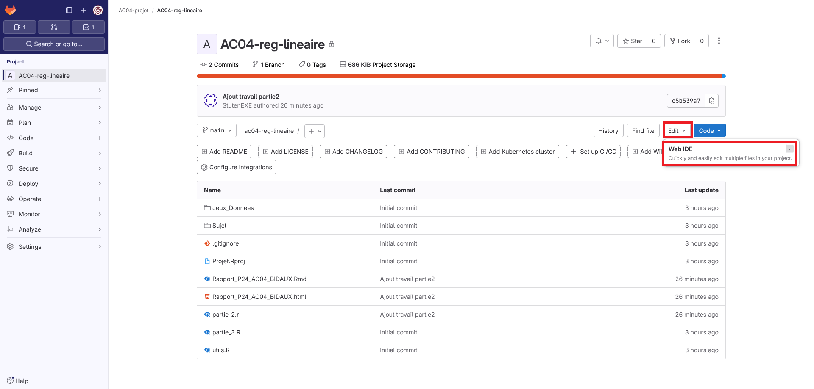
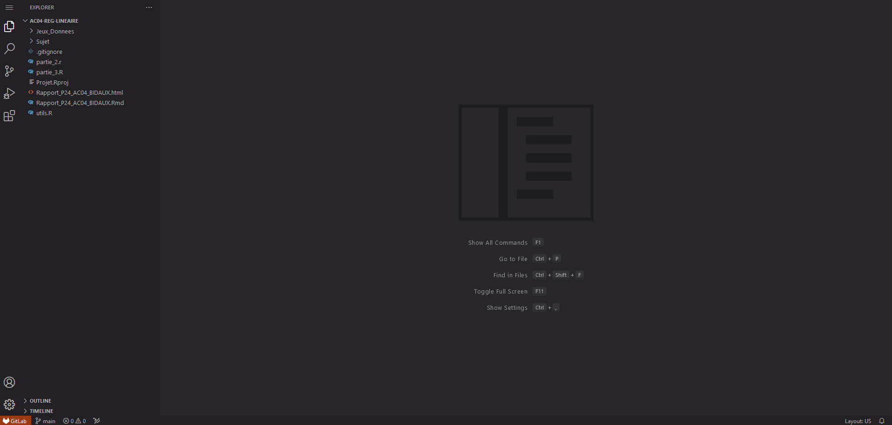
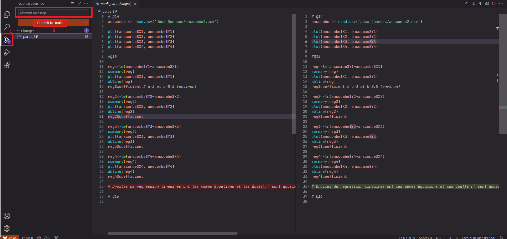
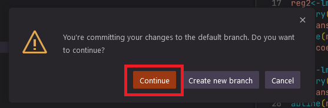

# Faire des modifications dans des fichiers
## Ouvrir l'éditeur intégré dans Gitlab
Code > Web IDE

Cela vous ouvre un nouvel onglet.
## Reporter les modifications effectuée sur ma machine

- ajouter les nouvelles réponses aux questions dans les documents

1. Ouvrir l'onglet "Source control" dans la barre à gauche de l'écran (encadré rouge n.1)
2. Décrire brièvement les modifications effectuées dans la barre "commit message" (encadré rouge n.2), exemple : Ajout questions 1 à 5
3. Cliquer sur "Commit to main" (encadré rouge n.3)

- Sélectionner "Continue"

